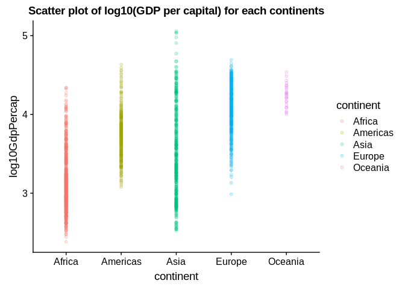
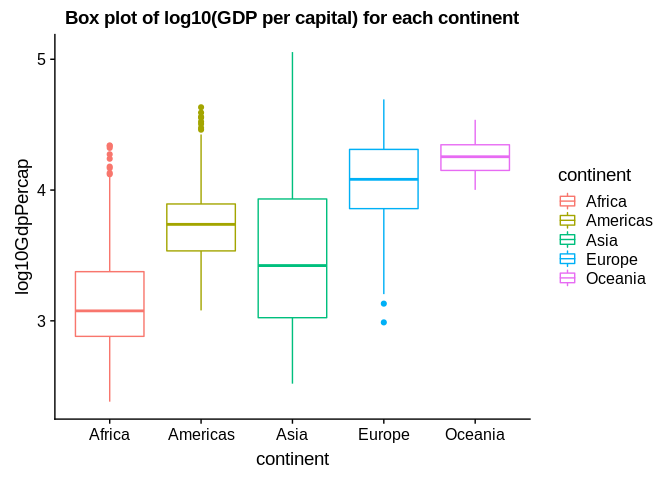
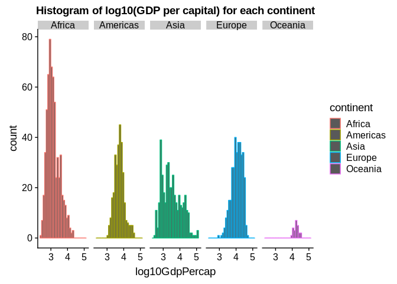
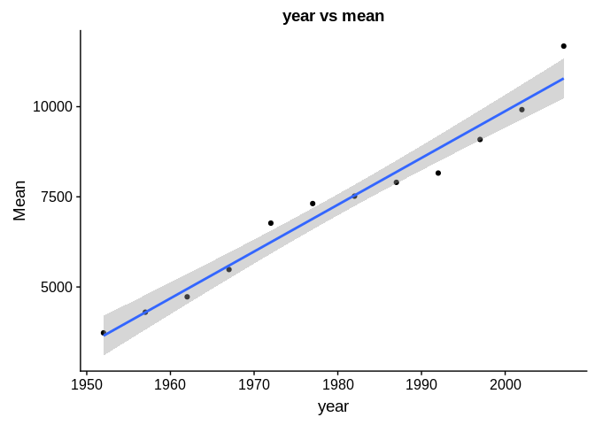
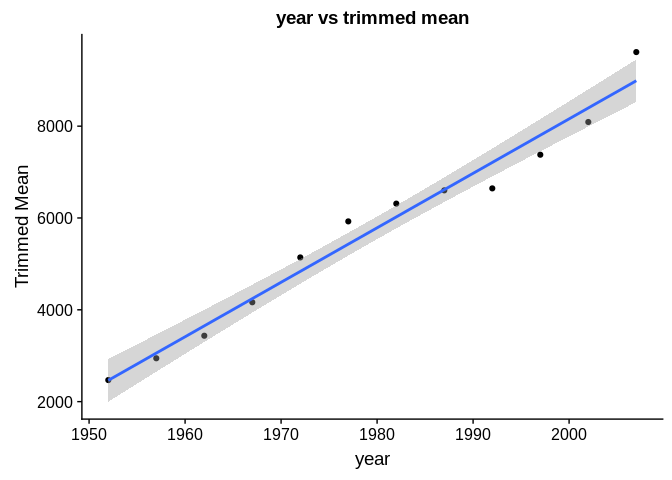
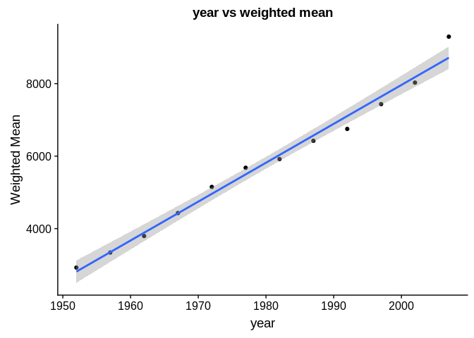
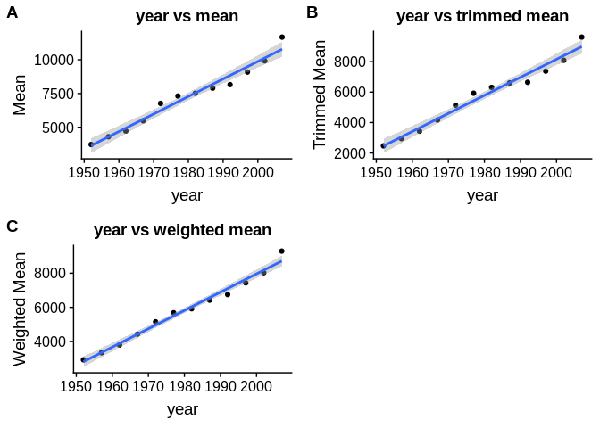
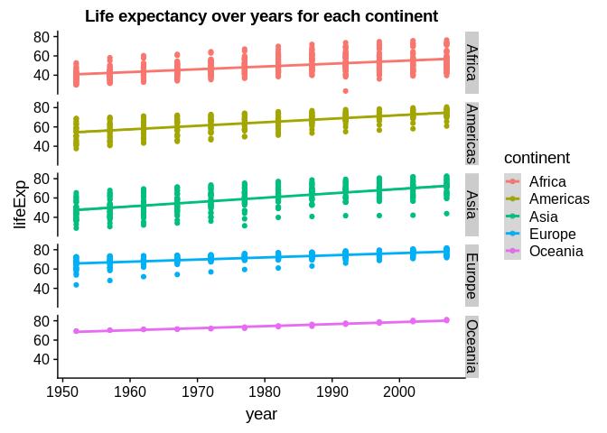
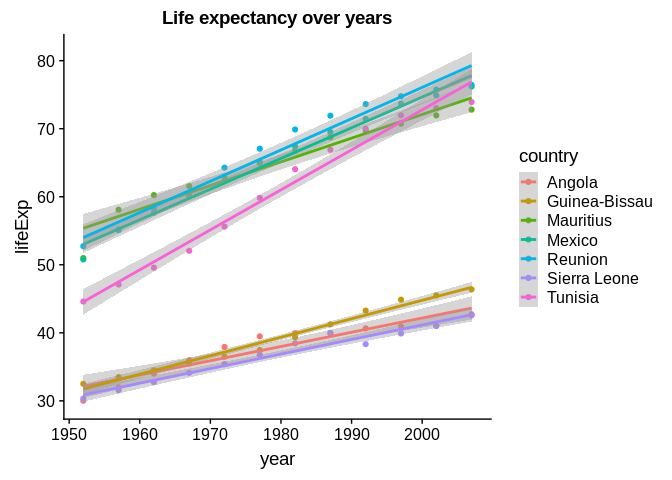
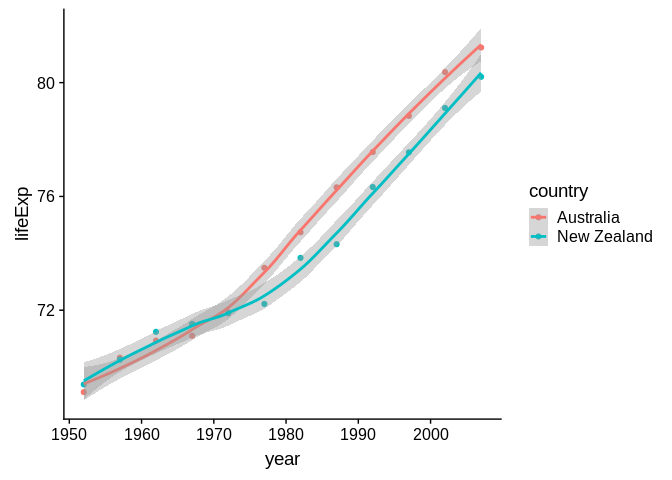

STAT 545 HW 03
================
Elijah Willie
September 30, 2018

Introduction
============

In this document, I wll attempt a few tasks. First, I will get the maximum and minimum GDP per capita for each continent and make some comments about them. Second, I will look investigate the spread of GDP per capita within each continent and make further comments. Third, I will compute three different types of means, and asses them relatively to each other. I will also provide plots for easier referencing. Lastly, I will, through the use of visual aids, attempt to explore how life expectancy is changing over time for different continents. So lets begin!!

Load in the required libraries
------------------------------

``` r
suppressMessages(library("tidyverse"))
library(gapminder)
library(cowplot)
```

    ## 
    ## Attaching package: 'cowplot'

    ## The following object is masked from 'package:ggplot2':
    ## 
    ##     ggsave

Task 1: Get the maximum and minimum of GDP per capita for all continents.
-------------------------------------------------------------------------

``` r
#add log10 gdpPercap
gapminder <- mutate(gapminder, log10GdpPercap =log10(gdpPercap))

#Compute the min and the max GDP per capital for each continent
my.tab <- summarise(group_by(gapminder, continent), min(log10GdpPercap), max(log10GdpPercap))
colnames(my.tab) <- c("Continent", "min", "max")
knitr::kable(my.tab)
```

| Continent |       min|       max|
|:----------|---------:|---------:|
| Africa    |  2.382316|  4.341458|
| Americas  |  3.079773|  4.632980|
| Asia      |  2.519828|  5.055084|
| Europe    |  2.988351|  4.693350|
| Oceania   |  4.001716|  4.537005|

We see that Africa has the smallest GDP Per capital amongst all the continents while Oceania has the highest of the minimum GDP per cap for all the continents. We also see that Asia has the highest GDP per cap for all continents and africa has the smallest maximum GDP per cap for all continents.

``` r
#Show this using some plots
ggplot(gapminder, aes(continent, log10GdpPercap)) + 
  geom_point(aes(color = continent),alpha = 0.2) +
  ggtitle("Scatter plot of log10(GDP per capital) for each continents")
```



This plot also reiterates what I concluded above.

Task 2: Look at the spread of GDP per capita within the continents.
-------------------------------------------------------------------

To ge the spread of the data, I will use a table first to show the the quartiles, the mean, the mode, the Inter Quartile Range, and the standard deviation of GDP per cap for each continent

``` r
#create a function to get mode of the data
# Create the function.
mode <- function(data) {
  #compute the unique value in the data 
  t1 <- unique(data)
  #compute which is the most occuring unize value
  t1[which.max(tabulate(match(data, t1)))]
}
```

``` r
sp.table <- summarize(group_by(gapminder, continent), quantile(log10GdpPercap, 0.25), quantile(log10GdpPercap, 0.5), quantile(log10GdpPercap, 0.75), mean(log10GdpPercap),mode(log10GdpPercap), sd(log10GdpPercap), IQR(log10GdpPercap))
colnames(sp.table) <- c("Continent", "1st quartile", "Median", "3rd Quartile", "mean", "Mode", "SD", "IQR" )
knitr::kable(sp.table)
```

| Continent |  1st quartile|    Median|  3rd Quartile|      mean|      Mode|         SD|        IQR|
|:----------|-------------:|---------:|-------------:|---------:|---------:|----------:|----------:|
| Africa    |      2.881525|  3.076326|      3.376105|  3.147894|  3.388990|  0.3733077|  0.4945803|
| Americas  |      3.535013|  3.737627|      3.893768|  3.741568|  3.771684|  0.2965612|  0.3587552|
| Asia      |      3.024072|  3.422719|      3.931926|  3.505493|  2.891786|  0.5680604|  0.9078538|
| Europe    |      3.858114|  4.082127|      4.310935|  4.058228|  3.204407|  0.3188679|  0.4528202|
| Oceania   |      4.150158|  4.254787|      4.346492|  4.246647|  4.001716|  0.1451969|  0.1963343|

we see that Africa has the smallest variation on GDP per cap amongst all the continents, while Asia has the highest GDP per cap

We can aslo view this graphically using a box plot

``` r
#use ggplot2 to create a boxplot for each continent
ggplot(gapminder, aes(continent, log10GdpPercap)) + 
  geom_boxplot(aes(color = continent)) +
  ggtitle("Box plot of log10(GDP per capital) for each continent")
```



You can also visualize the spread using a histogram

``` r
ggplot(gapminder,aes(x=log10GdpPercap, color=continent))+ 
  geom_histogram() + 
  facet_grid(~ continent) + 
  ggtitle("Histogram of log10(GDP per capital) for each continent")
```

    ## `stat_bin()` using `bins = 30`. Pick better value with `binwidth`.



Task 3: Compute a trimmed mean of life expectancy for different years. Or a weighted mean, weighting by population.
-------------------------------------------------------------------------------------------------------------------

### Compute plain mean by year

``` r
#group by year and compute the means just to get a feel for it
years.mean <- gapminder %>%
    group_by(year) %>%
    summarize("Mean" = mean(gdpPercap)) 

#Show the table
knitr::kable(years.mean)
```

|  year|       Mean|
|-----:|----------:|
|  1952|   3725.276|
|  1957|   4299.408|
|  1962|   4725.812|
|  1967|   5483.653|
|  1972|   6770.083|
|  1977|   7313.166|
|  1982|   7518.902|
|  1987|   7900.920|
|  1992|   8158.609|
|  1997|   9090.175|
|  2002|   9917.848|
|  2007|  11680.072|

We can also plot the means by year

``` r
plot1 <- ggplot(years.mean, aes(year, `Mean`)) + 
  geom_point() + 
  ggtitle("year vs mean") +
  geom_smooth(method = "lm", se = TRUE)

#show the plot
plot1
```



### Now that we have the hang of things, compute the trim mean

We trim by 10% so we will be discarding 1704 \* 0.10 = 170 observations

``` r
#Do a 10% trimmed mean
trimmed.means <- gapminder %>%
    group_by(year) %>%
    summarize("Trimmed Mean" = mean(gdpPercap, trim = 0.10)) 

#Show the table
knitr::kable(trimmed.means)
```

|  year|  Trimmed Mean|
|-----:|-------------:|
|  1952|      2469.257|
|  1957|      2944.170|
|  1962|      3434.946|
|  1967|      4163.954|
|  1972|      5140.784|
|  1977|      5925.991|
|  1982|      6312.725|
|  1987|      6602.002|
|  1992|      6645.059|
|  1997|      7378.100|
|  2002|      8090.746|
|  2007|      9614.171|

plot the means by year

``` r
plot2 <- ggplot(trimmed.means, aes(year, `Trimmed Mean`)) + 
  geom_point() + 
  ggtitle("year vs trimmed mean") +
  geom_smooth(method = "lm", se = TRUE)

#show the plot
plot2
```



### Now lets get really fancy by computing a weighted mean

``` r
#compute the weighted means for year
weighted.means <- gapminder %>%
    group_by(year) %>%
    summarize("Weighted Mean" = weighted.mean(gdpPercap,pop))

#Show the table
knitr::kable(weighted.means)
```

|  year|  Weighted Mean|
|-----:|--------------:|
|  1952|       2923.895|
|  1957|       3338.933|
|  1962|       3794.895|
|  1967|       4428.342|
|  1972|       5150.000|
|  1977|       5678.864|
|  1982|       5917.324|
|  1987|       6422.880|
|  1992|       6750.708|
|  1997|       7435.096|
|  2002|       8028.964|
|  2007|       9295.987|

plot the means by year

``` r
plot3 <- ggplot(weighted.means, aes(year, `Weighted Mean`)) + 
  geom_point() + 
  ggtitle("year vs weighted mean") +
  geom_smooth(method = "lm", se = TRUE) 

#show the plot
plot3
```



### Now put all the plot side by side so it's easier to see

``` r
#use the plot_grid function from th cowplot library to do this
plot_grid(plot1, plot2,plot3, labels = "AUTO")
```



Looking at the plots above, we see that we change the trend in the means by weighting it by the poputlation. The mean is closer to a straight line. Also, the mean and the trimmed mean are not too different.

Task 4: How is life expectancy changing over time on different continents?
--------------------------------------------------------------------------

Here I will be using chaining and piping to plot life expectancy over time for each continent

``` r
gapminder %>%
  ggplot(aes(x=year,y=lifeExp,color=continent)) +
   geom_point() +
   geom_smooth(method = "lm") + 
  facet_grid(continent ~ .) +
  ggtitle("Life expectancy over years for each continent")
```



It seems that on average, Oceania countries have higher life expectancy compared to other continents. I would however take this with a grain of salt as there is very little data as we can see from the plot above.

Find countries with interesting stories.
----------------------------------------

I am interested in looking at Africa as a whole. I am also interested in countries with high life expectancy (&gt;60), and low life expectancy (&lt;40).

### First look at African countries

``` r
medLA <- gapminder %>%
  filter(continent == "Africa") %>%
  group_by(country) %>%
  summarise(medLifeExp = median(lifeExp))

#Show the table
knitr::kable(medLA)
```

| country                  |  medLifeExp|
|:-------------------------|-----------:|
| Algeria                  |     59.6910|
| Angola                   |     39.6945|
| Benin                    |     50.0470|
| Botswana                 |     52.9270|
| Burkina Faso             |     47.1295|
| Burundi                  |     45.0310|
| Cameroon                 |     49.6055|
| Central African Republic |     44.0990|
| Chad                     |     48.4500|
| Comoros                  |     51.9360|
| Congo, Dem. Rep.         |     45.2570|
| Congo, Rep.              |     53.9385|
| Cote d'Ivoire            |     48.1595|
| Djibouti                 |     47.6655|
| Egypt                    |     54.6625|
| Equatorial Guinea        |     42.8430|
| Eritrea                  |     44.3385|
| Ethiopia                 |     44.7130|
| Gabon                    |     54.6770|
| Gambia                   |     43.7110|
| Ghana                    |     52.7500|
| Guinea                   |     41.8265|
| Guinea-Bissau            |     38.3960|
| Kenya                    |     53.8345|
| Lesotho                  |     49.1295|
| Liberia                  |     42.4175|
| Libya                    |     59.7985|
| Madagascar               |     47.9250|
| Malawi                   |     44.3880|
| Mali                     |     42.8150|
| Mauritania               |     52.2255|
| Mauritius                |     65.8205|
| Morocco                  |     57.6900|
| Mozambique               |     42.2885|
| Namibia                  |     53.3865|
| Niger                    |     41.9445|
| Nigeria                  |     45.1700|
| Reunion                  |     68.4745|
| Rwanda                   |     43.7165|
| Sao Tome and Principe    |     59.4505|
| Senegal                  |     50.6290|
| Sierra Leone             |     37.5605|
| Somalia                  |     41.4735|
| South Africa             |     53.5305|
| Sudan                    |     49.0690|
| Swaziland                |     48.0925|
| Tanzania                 |     49.0585|
| Togo                     |     54.1790|
| Tunisia                  |     61.9425|
| Uganda                   |     48.4380|
| Zambia                   |     46.0615|
| Zimbabwe                 |     53.1765|

``` r
#get the country with max median life expectancy
knitr::kable(medLA[medLA$medLifeExp == max(medLA$medLifeExp),])
```

| country |  medLifeExp|
|:--------|-----------:|
| Reunion |     68.4745|

``` r
#get the median life expectancy of my country "Liberia"
knitr::kable(medLA[medLA$country == "Liberia", ])
```

| country |  medLifeExp|
|:--------|-----------:|
| Liberia |     42.4175|

Wow Renunion has the highest median life expectancy in Africa. I have never heard of this place before. It turns out it is an island eas of madagascar! Thats pretty cool. :smirk: The median life expectancy in my country is pretty low! I guess we have some catching up to do. :muscle:

### Now look at countries with high and low life expectancy

Look at a subset of countries with the lowest and highest median life expectancies.

``` r
knitr::kable(filter(medLA,medLifeExp<40))
```

| country       |  medLifeExp|
|:--------------|-----------:|
| Angola        |     39.6945|
| Guinea-Bissau |     38.3960|
| Sierra Leone  |     37.5605|

``` r
knitr::kable(filter(medLA,medLifeExp>60))
```

| country   |  medLifeExp|
|:----------|-----------:|
| Mauritius |     65.8205|
| Reunion   |     68.4745|
| Tunisia   |     61.9425|

``` r
cc = c("Angola","Guinea-Bissau","Sierra Leone",
       "Mauritius","Reunion","Tunisia",
       "Mexico") # Mexico for comparison
```

Plot life expectancy over time.

``` r
gapminder %>%
  filter(country %in% cc) %>%
  ggplot(aes(x=year,y=lifeExp,color=country)) +
   geom_point() +
   geom_smooth(method = "lm") +
  ggtitle("Life expectancy over years")
```



It is quite interesting to see the massive disparity between a set of countries in Africa. I guess the quality of life does play a key role in life expectancy. A few countries have some catching up to do! :pensive:

Just before I finish, here's another interesting plot of life expectancy over time:

``` r
gapminder %>%
  filter(continent == "Oceania") %>%
  ggplot(aes(x=year,y=lifeExp,color=country)) +
  geom_point() +
  geom_smooth(method = "loess", span=3/4)
```



Hmm What happend in the mid-1970s in Australia? :worried:
